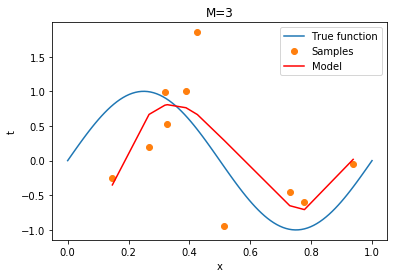

# Assignment 1 

Name:Deep Patel Id:1001765854

A.Generate 20 data pairs (X, Y) using y = sin(2*pi*X) + N 
      i. Use uniform distribution between 0 and 1 for X
     ii. Sample N from the normal gaussian distribution 
    iii. Use 10 for train and 10 for test 


```python
from math import *
import numpy as np
No_pairs=20
## A(i):Use uniform distribution between 0 and 1 for X
Xvalue=np.random.uniform(0,1,20)
print("X values:")
print(Xvalue);
```

    X values:
    [0.72971075 0.42612872 0.77791974 0.93800984 0.38880587 0.14687836
     0.51460934 0.31941742 0.2674086  0.32752789 0.51183065 0.02119486
     0.13790272 0.03596214 0.77627228 0.74131096 0.2750086  0.42360065
     0.24729067 0.32101882]


```python
from random import gauss
mylist=[]
## A(ii):Sample N from the normal gaussian distribution N=np.random.normal()
#+ np.random.normal()
#print(np.random.normal(0,1))
for i in range (0,No_pairs):
    mylist.append(sin(2*pi*Xvalue[i])+np.random.normal(0,1))
Yvalue = np.array(mylist)
print("Y values:")
print(Yvalue)
```

    Y values:
    [-0.44874332  1.85260709 -0.59609913 -0.05186883  1.00977149 -0.25375603
     -0.93638658  0.99499806  0.1985701   0.53365611 -0.10694298  1.94347627
      1.85797299 -0.6054306  -2.35329063 -1.49973019  2.8843758   1.10262956
      0.8425152   0.94268409]


```python
## A.Generate 20 data pairs (X, Y) using y = sin(2*pi*X) + N  
records=np.column_stack((Xvalue, Yvalue))
print("20 Data pairs:")
print(records)
```

    20 Data pairs:
    [[ 0.72971075 -0.44874332]
     [ 0.42612872  1.85260709]
     [ 0.77791974 -0.59609913]
     [ 0.93800984 -0.05186883]
     [ 0.38880587  1.00977149]
     [ 0.14687836 -0.25375603]
     [ 0.51460934 -0.93638658]
     [ 0.31941742  0.99499806]
     [ 0.2674086   0.1985701 ]
     [ 0.32752789  0.53365611]
     [ 0.51183065 -0.10694298]
     [ 0.02119486  1.94347627]
     [ 0.13790272  1.85797299]
     [ 0.03596214 -0.6054306 ]
     [ 0.77627228 -2.35329063]
     [ 0.74131096 -1.49973019]
     [ 0.2750086   2.8843758 ]
     [ 0.42360065  1.10262956]
     [ 0.24729067  0.8425152 ]
     [ 0.32101882  0.94268409]]


```python
## A(ii): Use 10 for train and 10 for test 
#an_array[numpy.argsort(an_array[:, 1])] Sorting 2d array
train_data=records[0:np.int64(No_pairs/2)][np.argsort(records[0:np.int64(No_pairs/2)][:,0])]
test_data=records[np.int64(No_pairs/2):][np.argsort(records[np.int64(No_pairs/2):][:,0])]
print("Train 10 Data [X:Y]:")
print(train_data)  
print("Test 10 Data [X:Y]:") 
print(test_data)  
```

    Train 10 Data [X:Y]:
    [[ 0.14687836 -0.25375603]
     [ 0.2674086   0.1985701 ]
     [ 0.31941742  0.99499806]
     [ 0.32752789  0.53365611]
     [ 0.38880587  1.00977149]
     [ 0.42612872  1.85260709]
     [ 0.51460934 -0.93638658]
     [ 0.72971075 -0.44874332]
     [ 0.77791974 -0.59609913]
     [ 0.93800984 -0.05186883]]
    Test 10 Data [X:Y]:
    [[ 0.02119486  1.94347627]
     [ 0.03596214 -0.6054306 ]
     [ 0.13790272  1.85797299]
     [ 0.24729067  0.8425152 ]
     [ 0.2750086   2.8843758 ]
     [ 0.32101882  0.94268409]
     [ 0.42360065  1.10262956]
     [ 0.51183065 -0.10694298]
     [ 0.74131096 -1.49973019]
     [ 0.77627228 -2.35329063]]


B. Using room mean square error, find weights of polynomial regression for order is 0, 1, 3, 9


```python
Xtrain_data=train_data[:,0].reshape(-1,1)
Ytrain_data=train_data[:,1].reshape(-1,1)
Xtest_data=test_data[:,0].reshape(-1,1)
Ytest_data=test_data[:,1].reshape(-1,1)
print("X Train Data:")
print(Xtrain_data)
print("Y Train Data:")
print(Ytrain_data)
print("X Test Data:")
print(Xtest_data)
print("Y Test Data:")
print(Ytest_data)
```

    X Train Data:
    [[0.14687836]
     [0.2674086 ]
     [0.31941742]
     [0.32752789]
     [0.38880587]
     [0.42612872]
     [0.51460934]
     [0.72971075]
     [0.77791974]
     [0.93800984]]
    Y Train Data:
    [[-0.25375603]
     [ 0.1985701 ]
     [ 0.99499806]
     [ 0.53365611]
     [ 1.00977149]
     [ 1.85260709]
     [-0.93638658]
     [-0.44874332]
     [-0.59609913]
     [-0.05186883]]
    X Test Data:
    [[0.02119486]
     [0.03596214]
     [0.13790272]
     [0.24729067]
     [0.2750086 ]
     [0.32101882]
     [0.42360065]
     [0.51183065]
     [0.74131096]
     [0.77627228]]
    Y Test Data:
    [[ 1.94347627]
     [-0.6054306 ]
     [ 1.85797299]
     [ 0.8425152 ]
     [ 2.8843758 ]
     [ 0.94268409]
     [ 1.10262956]
     [-0.10694298]
     [-1.49973019]
     [-2.35329063]]


```python
#Define function to find weights of polynomial regression for given degree

from sklearn.preprocessing import PolynomialFeatures 
from sklearn.linear_model import LinearRegression 
from sklearn.metrics import mean_squared_error
from math import sqrt

def create_polynomial_regression_model(X,Y,degree):
    "Creates a polynomial regression model for the given degree"
    poly_features = PolynomialFeatures(degree=degree)
    # transforms the existing features to higher degree features.
    X_train_poly = poly_features.fit_transform(X)
    # fit the transformed features to Linear Regression
    poly_model = LinearRegression()
    poly_model.fit(X_train_poly, Y)
    # predicting on training data-set
    y_train_predicted = poly_model.predict(X_train_poly)
    # evaluating the model on training dataset
    rmse_train = sqrt(mean_squared_error(Y, y_train_predicted))
    return (rmse_train)
```


```python
#For order=0
print("Order=0 weight of polynomial regression is: {}".format(create_polynomial_regression_model(Xtrain_data,Ytrain_data,0)))
#For order=1
print("Order=1 weight of polynomial regression is: {}".format(create_polynomial_regression_model(Xtrain_data,Ytrain_data,1)))
#For order=3
print("Order=3 weight of polynomial regression is: {}".format(create_polynomial_regression_model(Xtrain_data,Ytrain_data,3)))
#For order=9
print("Order=9 weight of polynomial regression is: {}".format(create_polynomial_regression_model(Xtrain_data,Ytrain_data,9)))
```

    Order=0 weight of polynomial regression is: 0.8207541262984682
    Order=1 weight of polynomial regression is: 0.7600630021149878
    Order=3 weight of polynomial regression is: 0.5810352675623498
    Order=9 weight of polynomial regression is: 2.74184643101829e-08


C. Display weights in table 


```python
import pandas as pd
from scipy.interpolate import *
                   # display the table

mydict = {'M0': np.polyfit(Xtrain_data[:,0],Ytrain_data[:,0],0), 
          'M1': np.polyfit(Xtrain_data[:,0],Ytrain_data[:,0],1),
          'M2': np.polyfit(Xtrain_data[:,0],Ytrain_data[:,0],2),
          'M3': np.polyfit(Xtrain_data[:,0],Ytrain_data[:,0],3),
          'M4': np.polyfit(Xtrain_data[:,0],Ytrain_data[:,0],4),
          'M5': np.polyfit(Xtrain_data[:,0],Ytrain_data[:,0],5),
          'M6': np.polyfit(Xtrain_data[:,0],Ytrain_data[:,0],6),
          'M7': np.polyfit(Xtrain_data[:,0],Ytrain_data[:,0],7),
          'M8': np.polyfit(Xtrain_data[:,0],Ytrain_data[:,0],8),
          'M9': np.polyfit(Xtrain_data[:,0],Ytrain_data[:,0],9),
         }
dict_df = pd.DataFrame({ key:pd.Series(value) for key, value in mydict.items() })

print(dict_df)
```

             M0        M1        M2         M3         M4           M5  \
    0  0.230275 -1.287957 -3.352415  35.905871 -24.582908 -1448.681068   
    1       NaN  0.853184  2.399002 -60.448061  89.285665  3786.403814   
    2       NaN       NaN  0.048072  28.731730 -99.694901 -3625.483537   
    3       NaN       NaN       NaN  -3.380358  39.904476  1552.977091   
    4       NaN       NaN       NaN        NaN  -4.383563  -290.274739   
    5       NaN       NaN       NaN        NaN        NaN    18.689861   
    6       NaN       NaN       NaN        NaN        NaN          NaN   
    7       NaN       NaN       NaN        NaN        NaN          NaN   
    8       NaN       NaN       NaN        NaN        NaN          NaN   
    9       NaN       NaN       NaN        NaN        NaN          NaN   
    
                 M6             M7            M8            M9  
    0   4986.519827   65175.173189  1.515762e+06 -3.269865e+07  
    1 -17089.878880 -237153.059674 -6.170816e+06  1.489653e+08  
    2  23148.312033  352348.190131  1.058099e+07 -2.926799e+08  
    3 -15648.216543 -275406.558605 -9.955367e+06  3.250522e+08  
    4   5467.842185  121566.410244  5.607537e+06 -2.245521e+08  
    5   -916.252039  -30152.519920 -1.931418e+06  9.989367e+07  
    6     56.315402    3876.621718  3.960166e+05 -2.855496e+07  
    7           NaN    -197.986132 -4.398331e+04  5.042804e+06  
    8           NaN            NaN  2.009842e+03 -4.970793e+05  
    9           NaN            NaN           NaN  2.069642e+04  


```python
import matplotlib.pyplot as plt  
%matplotlib inline
def plotgraphs(degree):
    def graph():
        t = np.linspace(0, 1, 100) 
        s=[]
        for i in range(0,100):
            s.append(sin(2*pi*t[i]))
        plt.plot(t, s,label='True function')   
    graph()#true function graph
    plt.plot(Xtrain_data,Ytrain_data,'o',label='Samples')
    p0=np.polyfit(Xtrain_data[:,0],Ytrain_data[:,0],int(degree))
    plt.plot(Xtrain_data,np.polyval(p0,Xtrain_data),'-r',label='Model')
    plt.xlabel('x')#xdata ranging from 0 to 1
    plt.ylabel('t')#t is the target yalue i.e value of y
    plt.title("M="+degree)#M no. of coeffecients
    plt.legend()
    plt.show()
plotgraphs("0")
plotgraphs("1")
plotgraphs("3")
plotgraphs("9")
```





E. Draw train error vs test error


```python
M=np.arange(10)
training=[]
test=[]

for i in M:
    poly_features = PolynomialFeatures(i)
    X_train_poly = poly_features.fit_transform(Xtrain_data)
    poly_model = LinearRegression()
    poly_model.fit(X_train_poly, Ytrain_data)
    y_train_predicted = poly_model.predict(X_train_poly)
    rmse_train = sqrt(mean_squared_error(Ytrain_data, y_train_predicted))
    training.append(rmse_train)
    rmse_test = sqrt(mean_squared_error(Ytest_data, poly_model.predict(poly_features.fit_transform(Xtest_data))))
    test.append(rmse_test)
print(M) 
print(training)
print(test)
plt.plot(M,training,'o',linestyle='solid',label='Training')
plt.plot(M,test,'o',linestyle='solid',label='Test')
plt.xlabel('M')
plt.ylabel('Erms')
#plt.axis([0, 10, 0, 10])
plt.legend()
plt.show()
```

    [0 1 2 3 4 5 6 7 8 9]
    [0.8207541262984682, 0.7600630021149878, 0.7401027742926507, 0.5810352675623498, 0.5785316956915262, 0.45568064634056, 0.40478624441630434, 0.25477013089236894, 0.08271997675349635, 2.74184643101829e-08]
    [1.5732745268227373, 1.350047124294045, 1.4324712133667827, 1.9964073442964123, 2.257101763515259, 5.076257614618841, 15.252446729979065, 50.394721063386015, 476.2132535913654, 4635.558911588402]


F. Now generate 100 more data and fit 9th order model and draw fit


```python
X100=np.random.uniform(0,1,100)
NewXtrain_data=Xtrain_data.copy() 
NewXtrain_data=np.sort(np.append(Xtrain_data,X100))
mynewlist=[]
for i in range (0,110):
    mynewlist.append(sin(2*pi*NewXtrain_data[i])+ np.random.normal(0,1))
NewYtrain_data = np.array(mynewlist)
print("X with new 100 train value:")
print(NewXtrain_data)
print("Y with new 100 train value:")
print(NewYtrain_data)
```

    X with new 100 train value:
    [0.00111096 0.00342132 0.02682324 0.03117789 0.04055519 0.0454675
     0.0542553  0.09062942 0.09112095 0.10928947 0.12876937 0.12938132
     0.1420777  0.14676419 0.14687836 0.14713715 0.16765952 0.1740695
     0.17454298 0.20984523 0.2153602  0.21959328 0.22262505 0.24804941
     0.2674086  0.26885946 0.29062484 0.29741465 0.30877981 0.31941742
     0.32331096 0.32752789 0.33471768 0.35250438 0.36888289 0.37676064
     0.38880587 0.40773185 0.42135348 0.42419087 0.42612872 0.43225523
     0.43522337 0.43931191 0.46218862 0.46514459 0.46844173 0.48183024
     0.48458231 0.4849614  0.51460934 0.52087301 0.53606177 0.55000174
     0.55195073 0.57126443 0.58215806 0.59585091 0.60129842 0.6267067
     0.62754803 0.6347064  0.64028503 0.64236642 0.64450059 0.65637761
     0.67185971 0.68134884 0.69547353 0.70408305 0.71909861 0.72882315
     0.72971075 0.75178431 0.75629112 0.77379033 0.77791974 0.78262732
     0.78337764 0.78889007 0.79242475 0.82001035 0.83337376 0.8394617
     0.84180637 0.84457136 0.84659229 0.84833435 0.85676525 0.86210877
     0.8674718  0.88912073 0.89544816 0.90070483 0.90378111 0.91516659
     0.91938216 0.93216185 0.93326299 0.93800984 0.94251263 0.94675943
     0.95630623 0.95892929 0.96177931 0.96259524 0.97801722 0.97821872
     0.98088426 0.9994443 ]
    Y with new 100 train value:
    [ 0.718161    1.45866901 -1.07763139 -1.08290315 -0.89853999 -0.94396424
      1.51580763  1.17383878 -1.13016113  3.38923759  2.20871612  1.17197332
      1.1441525  -0.3734992  -0.38720037  2.13430462  1.61059616  1.03590073
      1.33602107  2.37014209 -0.36856074  0.85652307  2.13206417  1.88361243
      1.12647577  1.64328188  1.80262882  0.57120502  2.06547743  1.3192611
      1.5292416  -0.07226202  0.83348331  1.82144058  1.40076117  0.85860549
      0.44096631  1.10375632  0.3832717  -0.5957861   0.95832211  0.85083259
      0.91023124  0.62501211 -0.19459774  0.63072293  1.90042148  1.69115656
      0.75759994  2.41152422 -1.25719214  0.43872087 -0.65883886 -0.01174549
     -0.03108458 -0.15813463 -0.32551361 -2.00687805  0.90838801  0.5417238
     -2.49813439 -2.2640621   0.0490791   0.0209963   0.60552963 -1.90274379
      0.01270728  0.21729493  0.21593417 -0.29723215 -1.92254365 -2.88851418
     -0.02907642 -0.53297697 -0.7561385  -1.72018783 -0.27780379 -2.1505946
     -1.05857565 -2.38457064 -1.12343858 -1.57987917 -1.09739309 -0.13063858
     -2.60195528 -2.61298702 -1.87598569 -0.14392194 -0.77981138 -0.98626097
      0.18430046 -0.75741925 -0.40138648 -0.73944797 -0.7244816  -0.87038352
     -0.124888    1.89613825  0.02427254  0.78525624 -0.91795055 -0.318472
      1.14306827  0.59830069 -1.0552706  -1.70594983  0.47779272  1.24878623
      1.37148312  0.2144711 ]


```python
def plotgraphnew(degree):
    def graph():
        t = np.linspace(0, 1, 110)
        s=[]
        for i in range(0,110):
            s.append(sin(2*pi*t[i]))
        plt.plot(t, s,label='True function')   
    graph()#true function graph
    plt.plot(NewXtrain_data,NewYtrain_data,'o',label='Samples')
    pnew=np.polyfit(NewXtrain_data,NewYtrain_data,int(degree))
    plt.plot(NewXtrain_data,np.polyval(pnew,NewXtrain_data),'-r',label='Model')
    plt.xlabel('x')#xdata ranging from 0 to 1
    plt.ylabel('t')#t is the target yalue i.e value of y
    plt.title("M="+degree)#M no. of coeffecients
    plt.legend()
    plt.show()
plotgraphnew("9")
```


G. Now we will regularize using the sum of weights. H. Draw chart for lambda is 1, 1/10, 1/100, 1/1000, 1/10000, 1/100000 


```python
from sklearn.linear_model import Ridge
def plot_lam_graphs(degree,lambda_value):
    def graph():
        t = np.linspace(0, 1, 100) 
        s=[]
        for i in range(0,100):
            s.append(sin(2*pi*t[i]))
        plt.plot(t, s,label='True function')   
    graph()#true function graph
    polynomial_features= PolynomialFeatures(degree)
    X_Poly = polynomial_features.fit_transform(Xtrain_data)
    polynomial_features.fit(X_Poly,Ytrain_data)
    model = Ridge(alpha=lambda_value)
    fit = model.fit(X_Poly,Ytrain_data)
    X_poly_plot = polynomial_features.fit_transform(Xtrain_data)
    Y_pred = model.predict(X_poly_plot)
    plt.plot( Xtrain_data, Y_pred, color='r',label="ln lamda = "+str(lambda_value))
    plt.plot(Xtrain_data,Ytrain_data,'o',label='Samples')
    plt.xlabel('x')#xdata ranging from 0 to 1
    plt.ylabel('t')#t is the target yalue i.e value of y
    plt.title("M="+str(degree))#M no. of coeffecients
    plt.legend()
    plt.show()
    
lambda_values = np.array([1, 0.1, 0.01, 0.001, 0.0001,0.00001])    
for i in lambda_values:
    plot_lam_graphs(9,i)
```


I. Now draw test  and train error according to lamda  


```python
training=[]
test=[]

for i in lambda_values:
    poly_features = PolynomialFeatures(9)
    X_train_poly = poly_features.fit_transform(Xtrain_data)
    poly_model = Ridge(alpha=i)
    poly_model.fit(X_train_poly, Ytrain_data)
    y_train_predicted = poly_model.predict(X_train_poly)
    rmse_train = sqrt(mean_squared_error(Ytrain_data, y_train_predicted))
    training.append(rmse_train)
    rmse_test = sqrt(mean_squared_error(Ytest_data, poly_model.predict(poly_features.fit_transform(Xtest_data))))
    test.append(rmse_test)
print(lambda_values) 
print(training)
print(test)
plt.plot(lambda_values,training,'o',linestyle='solid',label='Training')
plt.plot(lambda_values,test,'o',linestyle='solid',label='Test')
plt.xlabel('Lamda')
plt.ylabel('Erms')
#plt.axis([0, 10, 0, 10])
plt.legend()
plt.show()
```

    [1.e+00 1.e-01 1.e-02 1.e-03 1.e-04 1.e-05]
    [0.758954230191078, 0.7220578719710828, 0.6549231653075398, 0.6102056170260717, 0.5616940903164424, 0.5413511455886493]
    [1.4268566883406897, 1.3252736492269495, 1.3224989704908683, 1.4914077728630224, 1.8332603389396318, 1.8440668876901813]


J.Based on the best test performance, what is your model?

<strong>Model with lamda value is 0.01 is the best because the test error is minimum in it compared to others.(or whichever is the lowest when vales changes)</strong>

Reference:
RMSE help:https://towardsdatascience.com/polynomial-regression-bbe8b9d97491
Polynomial regression: https://www.geeksforgeeks.org/python-implementation-of-polynomial-regression/
3: https://www.youtube.com/watch?v=ro5ftxuD6is
4: https://www.youtube.com/watch?v=4JQR9k2OXcw
Draw graph of truth value of equation : https://stackoverflow.com/questions/14000595/graphing-an-equation-with-matplotlib
Pattern Recognition and machine learning book: http://users.isr.ist.utl.pt/~wurmd/Livros/school/Bishop%20-%20Pattern%20Recognition%20And%20Machine%20Learning%20-%20Springer%20%202006.pdf
Question video: https://www.youtube.com/watch?v=4JQR9k2OXcw
Graph label: https://pythonprogramming.net/legends-titles-labels-matplotlib-tutorial/
2d array sorting: https://kite.com/python/answers/how-to-sort-the-rows-of-a-numpy-array-by-a-column-in-python
Regularization:https://www.kaggle.com/mtax687/l2-regularization-of-neural-network-using-numpy
Regularization2:https://courses.engr.illinois.edu/ece420/fa2017/AdaptiveSignalProcessing.pdf
Regularization3:https://utkuufuk.com/2018/05/04/learning-curves/


```python

```
